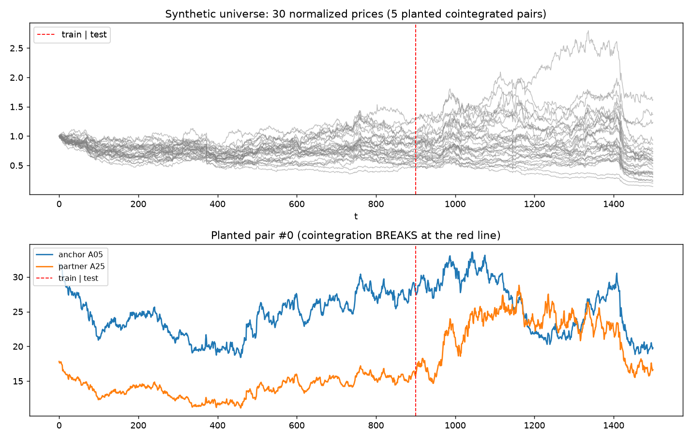
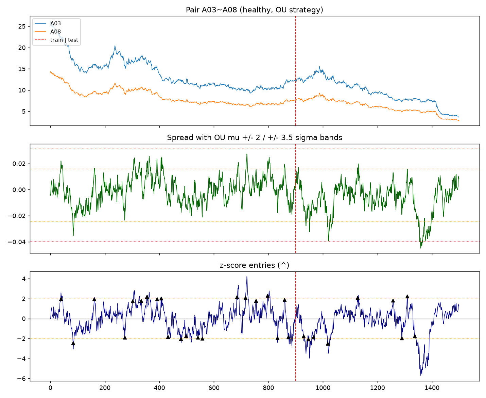
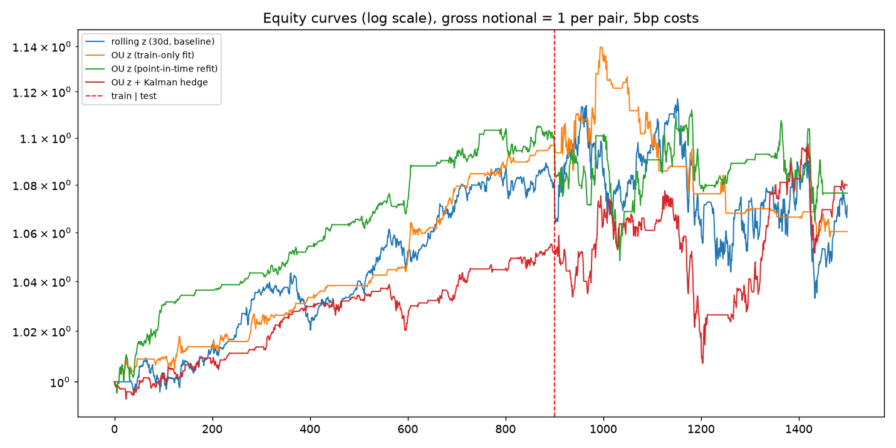

# 03 · 实验记录与发现

> 全部结果可复现:`.venv/bin/python run.py --seed 7`(单次)与 `run.py --mc 12 --seed 7`(Monte Carlo)。
> 设置:30 资产 / 1500 天 / 5 植入协整对(其中 2 对在测试期断裂)/ 训练 60% / 成本 5bp。

## 1. 合成数据质量(stylized facts,seed 7)

| 检验 | 实测 | 期望 | 通过 |
|---|---|---|---|
| 价格非平稳(ADF p>0.05) | 87% | >80% | ✅ |
| 日收益超额峰度 | 3.15 | >0(厚尾) | ✅ |
| 波动聚集(LB(10) on r², p<0.05) | 97% | >50% | ✅ |
| 收益 \|ACF(1)\| 中位数 | 0.017 | <0.15 | ✅ |
| 植入价差平稳(训练期 ADF) | 100% | >90% | ✅ |
| 植入价差半衰期(训练期) | 8.1–29.8 天 | 5–60 | ✅ |

结论:合成宇宙具备真实日频数据的程式化事实,同时保留了已知的 ground truth。



## 2. 配对筛选(仅训练期,EG p<0.05 + 半衰期 5–60 天)

| 配对 | β 估计 | β 真值 | EG p | 半衰期 | 真对 | 测试期断裂 |
|---|---|---|---|---|---|---|
| A05~A25 | 0.848 | 0.847 | 6.4e-04 | 15.4 | ✅ | 💥 是 |
| A03~A08 | 0.831 | 0.829 | 6.7e-07 | 8.1 | ✅ | 否 |
| A01~A16 | 0.894 | 1.079 | 2.3e-02 | 20.1 | ✅ | 💥 是 |
| A14~A19 | 0.703 | 0.712 | 1.1e-04 | 11.4 | ✅ | 否 |

**召回 4/5,查准 4/4**。漏掉的第 5 对是 EG 检验功效不足(其 p>0.05);A01~A16 选择了反向回归故 β≈1/β_true,但两者张成同一协整空间,价差仍平稳可交易。0 假阳性——半衰期过滤有效。

## 3. 策略对比(seed 7,组合 = 等权配对)

| 策略 | IS Sharpe | OOS Sharpe | OOS 年化% | OOS 最大回撤% | OOS 日胜率% | OOS 交易数 |
|---|---|---|---|---|---|---|
| 滚动 z(30d,基线) | 1.15 | −0.04 | −0.22 | −7.50 | 45.3 | 96 |
| OU z(仅训练期拟合) | 2.13 | −0.42 | −1.36 | −7.15 | 19.8 | 22 |
| **OU z(点内重估)** | 1.90 | −0.22 | −0.86 | −4.81 | 32.8 | 33 |
| **OU z + Kalman 对冲** | 1.15 | **0.28** | **1.19** | −6.53 | 36.5 | 69 |

分配对明细(OU 点内重估,测试期)——**断裂对 vs 健康对泾渭分明**:

| 配对 | 断裂 | OOS Sharpe | OOS 年化% | 交易数 | 逐笔胜率% | 平均持仓(天) |
|---|---|---|---|---|---|---|
| A05~A25 | 💥 | −0.56 | −3.87 | 7 | 28.6 | 14.9 |
| A03~A08 | — | +0.42 | +0.61 | 9 | 66.7 | 9.9 |
| A01~A16 | 💥 | −0.30 | −3.83 | 10 | 50.0 | 17.3 |
| A14~A19 | — | +0.77 | +3.65 | 7 | 85.7 | 20.1 |




## 4. Monte Carlo:12 个独立合成宇宙(robustness)

样本外 Sharpe 分布(`output/mc_results.csv` 有逐宇宙明细):

| 策略 | 均值 | 标准差 | 最小 | 最大 | 为正比例 | OOS 年化均值% | 平均回撤% | 平均找到配对数 |
|---|---|---|---|---|---|---|---|---|
| **OU z(点内重估)** | **0.33** | 0.58 | −0.74 | 1.07 | **75%** | 0.74 | −4.57 | 5.25 |
| OU z + Kalman | 0.33 | 0.80 | −1.12 | 1.78 | 75% | 0.71 | −5.27 | 5.25 |
| OU z(静态拟合) | −0.17 | 0.51 | −0.91 | 1.05 | 33% | −0.27 | −4.01 | 5.25 |
| 滚动 z(基线) | −0.07 | 0.71 | −1.81 | 1.15 | 42% | −0.53 | −8.33 | 5.25 |

**结论:**
1. **OU 参数点内滚动重估是生死线**:同样的信号形式,静态拟合 IS 最优(2.13)但 OOS 为负(33% 为正)——参数漂移 + 制度断裂下,训练期参数是负资产;
2. Kalman 对冲是可行替代,均值相同、方差更大(单宇宙可能很差如 −1.12,也可能最好如 +1.78);
3. 朴素滚动基线换手 3 倍于 OU 模式(96 vs 33 笔),成本侵蚀后垫底;
4. 配对召回平均 5.25/5(含 ~1 个伪对)——EG 5% 水平 + 半衰期过滤的组合在这个量级的宇宙上够用;
5. OOS Sharpe 的宇宙间标准差 ~0.6 提醒我们:**单宇宙单次回测的 Sharpe 排名不可信,这正是合成数据 Monte Carlo 的价值**。

## 5. 开发过程中的三个教训(都已修复并写进测试路径)

1. **论文公式必须自行推导核对**。Columbia 论文 PDF 的 OU 方差公式被排版损坏,直接照抄导致 σ_eq 缩小 2.4 倍、z 放大、换手爆炸(单对 600 天 206 笔、胜率 10%)。修复后 IS Sharpe 从 −0.38 → 1.90。
2. **止损后必须 disarming**。发散价差(断裂对)在 |z|≥3.5 止损后,下一日 z 仍 >3.5,无锁定机制会立即反向重进 → 止损变每日摩擦。加 disarmed 状态(直到 |z| 回到入场带)后断裂对交易数从 206 降到 7。
3. **协整回归方向要双向择优**。单向 OLS 可能估出 1/β(A14~A19:1.392 vs 真值 0.712)。虽然该"错误方向"的价差仍是平稳的(张成同一空间),但 β 展示混乱、对冲权重偏差;双向取 EG 更显著方向后 β_est 0.703 ≈ β_true 0.712。

## 6. 复现命令

```bash
.venv/bin/python run.py --seed 7          # 本文档所有单次结果
.venv/bin/python run.py --mc 12 --seed 7  # 本文档 Monte Carlo 结果
```

更换 `--seed` 即得到一个全新的平行宇宙;`--days/--assets/--pairs` 可调宇宙规模。逐宇宙明细见 `output/mc_results.csv`。
