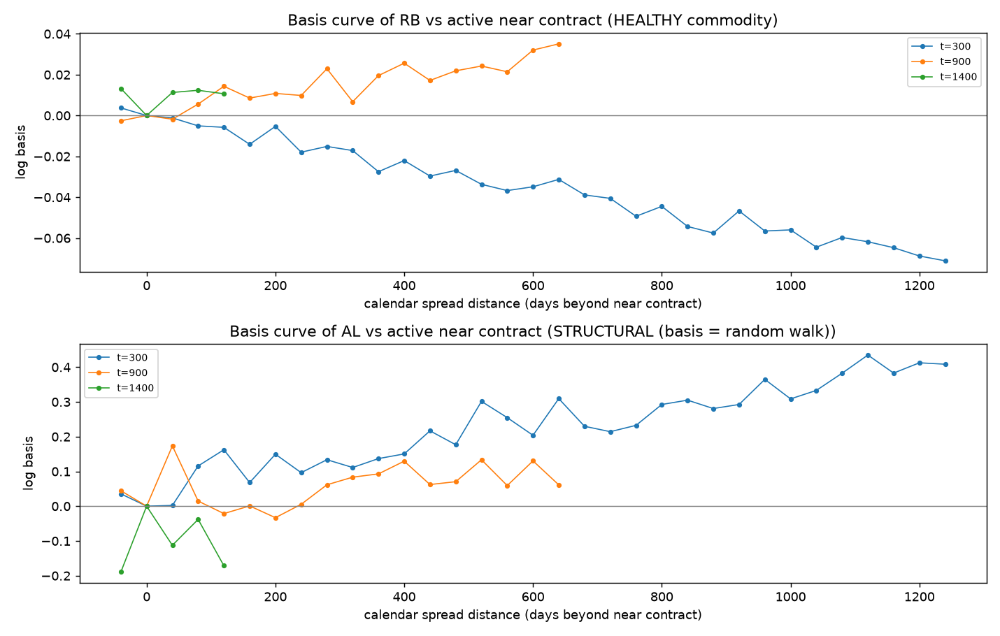
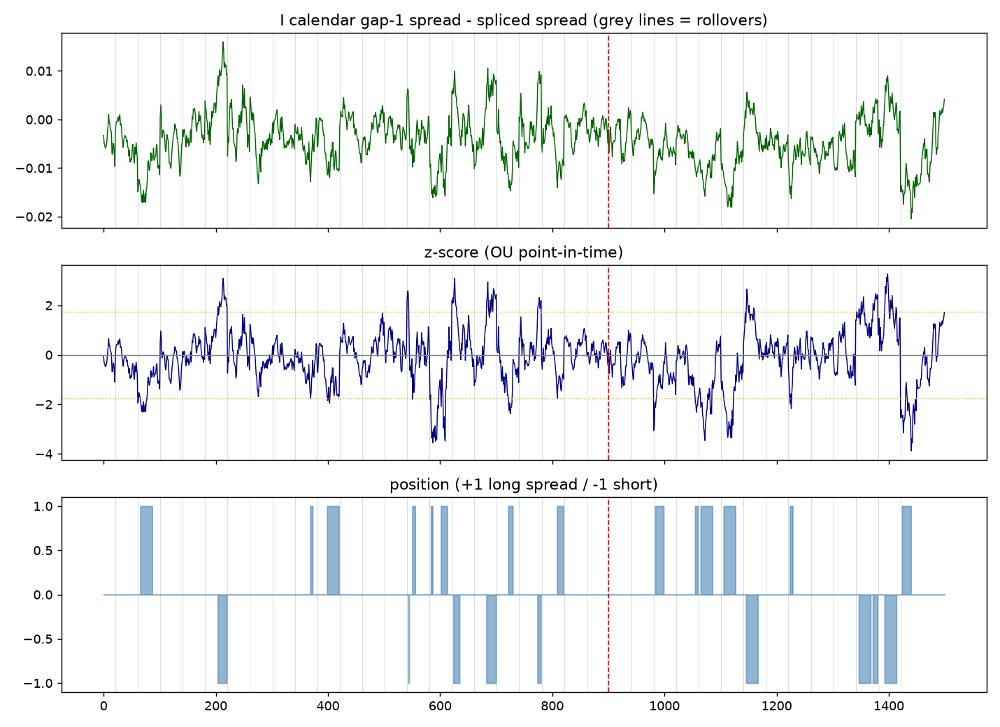
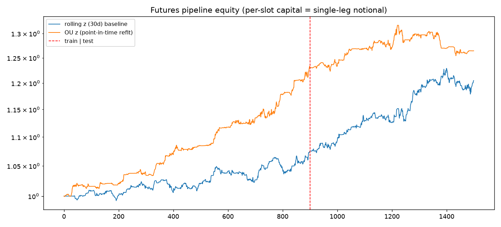

# 05 · 期货化:中国商品期货均值回归套利(仿真版)

> 需求:**中国期货的均值回归套利;不预设套利品种,由算法发现;暂无真实数据。**
> 本文对应 `mrarb/futures.py` + `frun.py`——把 [02 · 方法论](02-methodology.md) 的"股票式"管道改造成期货机器,仍在零数据条件下端到端验证。

```bash
.venv/bin/python frun.py --seed 11          # 单次全流程
.venv/bin/python frun.py --mc 8 --seed 11   # Monte Carlo
```

## 1. 与股票版(股票配对)的差异

| 维度 | 股票版(run.py) | 期货版(frun.py) |
|---|---|---|
| 价格生成 | 连续价格随机游走 + 植入协整对 | **期限结构**:现货过程 + 到期网格 + carry + 基差 |
| 套利载体 | 任意两资产 log 价差 | **跨期价差**(同品种相邻/隔月合约)+ **跨品种价差**(前约对),候选全扫描 |
| 换月 | 无 | 全局到期网格,近月剩 20 天强平换月,换月窗口禁止持仓 |
| 盈亏 | 美元中性权重 | **手数 × 合约乘数 × 价差变动**(人民币账户口径) |
| 成本 | 一刀切 5bp | 每手手续费(元)或成交额万分比 + **1 跳滑点/边** |
| 风险监控 | 回撤/Sharpe | 另加**保证金占用率**(相对当期单腿名义) |
| 配对发现 | MSD + EG | ADF(跨期)/ 双向 EG(跨品种)+ **稳定性门槛** + 多样性约束 |

## 2. 期货化合成器(`futures.py: simulate_futures`)

**期限结构**(每个品种 c,j 号合约,τ=剩余交易日):

```
log F_c(t, E_j) = log P_c(t) + τ_j(t)·k_c(t) + u_{c,j}(t)
```

- `P_c`:现货对数价——市场+行业因子、GARCH(1,1) 波动聚集、t(5) 厚尾、跳跃(复用股票版机制);
- `k_c(t)`:**净持仓成本 carry**(仓储+资金−便利收益),围绕品种均值 k̄ 的慢速 OU(半衰期 120 天)→ 远期曲线整体升降;
- `u_{c,j}(t)`:各合约的基差噪声,分两种**不给算法提示**的形态:
  - **健康品种**(默认 70%):快速 OU(半衰期 8–18 天)→ 跨期价差平稳可交易;
  - **结构性品种**(30%):随机游走 → 跨期价差不回归,算法必须自己识别并剔除;
- **换月**:全局到期日网格(每 40 交易日一档),近月 = 剩余 τ≥20 天中最近者;所有品种同日换月;`rollover_block` 在换月前 1 天与后 2 天强制空仓并重新武装(换月拼接序列有跳变,禁止跨换月持仓);
- **植入跨品种对**:同行业品种间 `log P_b = α + β·log P_a + w`,w 为快速 OU——跨品种 ground truth(跨品种协整"顺势"传导到合约价)。

**品种规格**(`_SPEC_TABLE`,仿真量级、真实世界形状):12 品种 4 板块(黑色 RB/HC/I、有色 CU/AL/ZN、油脂 Y/P/OI、化工 L/PP/V),乘数 5–100 元/点、跳价 0.5–10 元、手续费每手 2–8 元或万分比(CU 用成交额费率)、保证金 8–12%。**这些是形状参数,不是真实交易所参数**——接真实数据时按交易所公式表替换。

## 3. 算法发现(不预设品种)

候选池 **90 个**:每品种 gap-1 与 gap-2 两个跨期价差(24 个)+ 全部跨品种前约组合(66 个,**不做行业预过滤**)。

四道闸门(只用训练期):

1. **平稳性**:跨期用 ADF(价差本身),跨品种用双向 Engle-Granger 取更显著方向;
2. **稳定性门槛**:`max(ADF p_前半, ADF p_后半) < 0.10`——**这是被假阳性逼出来的**:结构性品种的单次 ADF 有时 p≈0.003 会蒙混过关,但平稳性不会在训练期前后两半同时成立。教训记录:宁可多杀一千;
3. **半衰期 ∈ [5, 60] 天 + 波动下限 σ_eq ≥ 0.15%**(太慢没法交易,太薄不够付手续费);
4. **组合约束**:每品种 ≤1 个跨期槽 + ≤1 个跨品种槽,跨期槽总数 ≤5(多样性——跨期 p 值通常 1e-8 量级会碾压跨品种的 1e-3~1e-6,不设上限则跨品种永远选不进来),总槽位 ≤8。

seed 11 实测:入选 8 槽 = 5 跨期(I/Y/V/HC/P)+ 2 个植入跨品种对(P~Y、HC~RB)+ **1 个假阳性**(V~ZN:因子相关但非协整,EG 1% 蒙过)——精确率 7/8,假阳性由 OOS 止损兜底;结构性品种 AL/OI 全部被稳定性门槛拒绝。

## 4. 手数化回测(`backtest_slot`)

- **手数换算**:跨期天然 1:1(同乘数);跨品种价差 = logF_b − β·logF_a,做 1 手 b 需要 `n_a = round(β · m_b·P̄_b / (m_a·P̄_a))` 手 a(乘数与价格水平折算,取整);
- **日盈亏(元)**:`pos·(n_b·m_b·ΔP_b − n_a·m_a·ΔP_a)`,仓位 t−1 日收盘决定、承担 t 日变动(次日执行不变);
- **成本**:换手 |Δpos| × Σ(每腿手续费 + 1 跳滑点)×手数;换月窗口强制平仓自动付双边;
- **归一**:每槽固定资本 = 单腿名义(训练均值),组合 = 等权槽位;保证金占用 = 双腿保证金 ÷ 当期单腿名义(实测 11%–36%)。

## 5. 结果

### seed 11 单次(策略对比,OOS)

| 策略 | IS 夏普 | OOS 夏普 | OOS 年化% | OOS 回撤% |
|---|---|---|---|---|
| 滚动 z 基线 | 0.87 | **1.31** | 4.88 | −4.07 |
| OU z(点内重估) | 2.34 | 0.39 | 1.09 | −4.80 |

单种子下 rolling OOS 反超 OU——再次验证"单宇宙排名不可信"。

### Monte Carlo(8 个期货宇宙,OOS)

| 策略 | OOS Sharpe 均值 | 标准差 | 为正比例 | 平均年化% | 平均回撤% |
|---|---|---|---|---|---|
| **OU z(点内重估)** | **1.87** | 1.10 | **8/8** | 1.94 | −1.47 |
| 滚动 z 基线 | 1.08 | 0.84 | 7/8 | 1.65 | −2.19 |





## 6. 诚实警示(为什么期货版数字比股票版好看)

1. **跨期价差是"简单模式"**:1:1 手数无对冲误差、半衰期快(~8 天)、拼接噪声小——生成器里健康跨期价差比股票协整对"干净",Sharpe 偏高部分是生成器特性;
2. **未建模**:涨跌停(连续停板时价差无法平仓)、交割月限仓/保证金梯度、夜盘跳空、微观结构噪声、逼仓行情;
3. carry 只有一个慢 OU 形态;真实的季节性(如油脂)会在价差上留下年度周期;
4. 规格表是"形状正确"的仿真参数,实盘前必须按交易所公式替换;
5. 结论只到"**管道与发现算法在期货语义下端到端可用**"为止,数字本身不可外推。

## 7. 接真实数据的改造点(相比股票版多出的三件事)

1. **合约数据**:拉取分月合约日线 → 复现同样的 `logF (n_mat, T, n_com)` 结构与全局换月日(用主力合约规则或流动性规则定 near);akshare `futures_zh_daily_sina` / tushare `fu_daily` 均可;
2. **规格表**:用交易所参数(乘数、最小变动价位、手续费公式含平今、保证金梯度)替换 `_SPEC_TABLE`;
3. **到期日历**:真实到期月份不均匀(如 1/5/9 月合约),把 `expiry_step=40` 换成真实交易日历即可,管道其余不变。

筛选/信号/回测代码零改动——这是期货化仿真版存在的意义:**先在带 ground truth 的期货沙盘里把逻辑磨对,真实数据只做"插拔"。**
