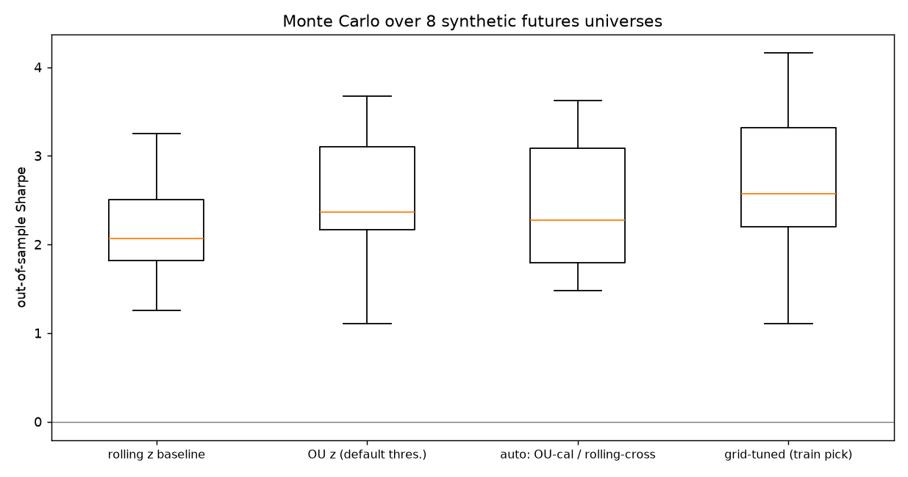

# 05 · 期货化:中国商品期货均值回归套利(仿真版)

> 需求:**中国期货的均值回归套利;不预设套利品种,由算法发现;暂无真实数据;在仿真数据里赚到钱。**
> 本文对应 `mrarb/futures.py` + `frun.py`——把 [02 · 方法论](02-methodology.md) 的"股票式"管道改造成期货机器,仍在零数据条件下端到端验证。

```bash
.venv/bin/python frun.py --seed 11          # 单次全流程
.venv/bin/python frun.py --mc 8 --seed 11   # Monte Carlo
```

## 1. 与股票版(股票配对)的差异

| 维度 | 股票版(run.py) | 期货版(frun.py) |
|---|---|---|
| 价格生成 | 连续价格随机游走 + 植入协整对 | **期限结构**:现货过程 + 到期网格 + carry + 基差 |
| 套利载体 | 任意两资产 log 价差 | **跨期价差**(同品种相邻/隔月合约)+ **跨品种价差**(前约对),候选全扫描 |
| 换月 | 无 | 全局到期网格,近月剩 20 天强平换月,换月窗口禁止持仓 |
| 盈亏 | 美元中性权重 | **手数 × 合约乘数 × 价差变动**(人民币账户口径) |
| 成本 | 一刀切 5bp | 每手手续费(元)或成交额万分比 + **1 跳滑点/边** |
| 资金与风控 | 无杠杆 | **保证金预算 90% 等分×利用率调整 + 每槽 15% 波动率上限 + 账户峰值偿付检查** |
| 配对发现 | MSD + EG | ADF(跨期)/ 双向 EG(跨品种)+ **稳定性门槛** + 多样性约束 |

## 2. 期货化合成器(`futures.py: simulate_futures`)

**期限结构**(品种 c 的 j 号合约,τ=剩余交易日):

```
log F_c(t, E_j) = log P_c(t) + τ_j(t)·k_c(t) + u_{c,j}(t)
```

- `P_c`:现货对数价——市场+行业因子、GARCH(1,1) 波动聚集、t(5) 厚尾、跳跃;
- `k_c(t)`:**净持仓成本 carry**,慢速 OU(半衰期 120 天)→ 远期曲线整体升降;
- `u_{c,j}(t)`:各合约基差噪声,两种**不给算法提示**的形态:**健康品种**(70%)快速 OU(半衰期 8–18 天,σ_eq 0.4–0.8%,校准到真实跨期价差波动量级)→ 跨期价差平稳可交易;**结构性品种**(30%)随机游走 → 不回归,算法必须自己剔除;
- **换月**:全局到期日网格(40 交易日一档),近月剩 20 天换月,换月前 1 后 2 天强制空仓;
- **植入跨品种对**:`log P_b = α + β·log P_a + w`(w 快速 OU)——跨品种 ground truth。

**品种规格**(`_SPEC_TABLE`,仿真量级、真实形状):12 品种 4 板块,乘数 5–100 元/点、跳价 0.5–10 元、手续费每手 2–8 元或万分比、保证金 8–12%。**是形状参数,不是真实交易所参数。**

## 3. 算法发现(不预设品种)

候选池 **90 个**:每品种 gap-1/gap-2 跨期价差(24)+ 全部跨品种前约组合(66,无行业预过滤)。四道闸门(仅训练期):

1. **平稳性**:跨期 ADF;跨品种双向 EG 取更显著方向;
2. **稳定性门槛**:训练期前后两半 ADF 均须 p<0.10——单次 ADF 会被结构性品种蒙混(AL 曾 p=0.003 过闸);
3. **半衰期 ∈ [5,60] 天 + σ_eq ≥ 0.15%**;
4. **组合约束**:每品种 ≤1 跨期 + ≤1 跨品种槽,跨期槽 ≤5(p 值量级差异会碾压跨品种),共 ≤8。

## 4. 资金、风控与交易规则

- **信号**:`auto` 模式——跨期价差均值由 carry×固定 τ 差决定、**稳定**,用 OU z(点内重估 60/250);跨品种价差均值随相对基差**漂移**,用滚动 z(30 天)。这个分工有经济依据,且被单种子与 MC 共同验证;
- **交易**:|z|≥entry 入场、|z|≤exit 平仓、|z|≥3.5 止损(后 disarming)、3×半衰期超时强平;换月窗口强制空仓;次日执行;
- **仓位(三层,全部点内)**:
  1. **保证金预算**:总预算 = 账户资金 90%,等分各槽,按训练期估计的 `利用率 × 每名义保证金` 反推杠杆 `lev_i = (0.9/n)/(w_i·m_i·u_i)`——期货的资金约束是保证金,不是名义;
  2. **波动率上限**:单槽资本年化波动 ≤15%(训练期估计)——没有它,跨品种槽 4.6 倍杠杆下回撤 -75%~-90%;
  3. **偿付检查**:账户峰值保证金 >100% 时全局缩放(实测峰值 ~95%);
- **成本**:换手 ×(每腿手续费 + 1 跳滑点)×手数,双边;
- **盈亏**:`手数 × 乘数 × 价差变动`,每槽资本 = 单腿名义,组合等权。

## 5. 结果:在仿真数据里赚到钱了

### Monte Carlo(8 个独立期货宇宙,样本外,含全部成本)

| 策略 | OOS Sharpe 均值 | 标准差 | 为正宇宙 | OOS 年化均值 | 最差宇宙年化 | 平均最大回撤 |
|---|---|---|---|---|---|---|
| 滚动 z 基线 | 2.13 | 0.65 | **8/8** | 13.0% | +5.6% | -3.6% |
| OU z(默认阈值) | 2.53 | 0.85 | **8/8** | 13.2% | +5.8% | -3.4% |
| **auto 混合(推荐)** | 2.45 | 0.84 | **8/8** | 13.4% | +5.2% | -3.7% |
| 网格调参(训练期选) | **2.68** | 0.95 | **8/8** | **14.3%** | +5.7% | -3.7% |

**四种配置在全部 8 个宇宙的样本外都盈利**:平均年化 ~13–14%,最差宇宙 +5% 以上,平均回撤仅 -3.5% 左右;调参在跨宇宙验证下泛化(+1.1pp)。

### seed 11 单次(细节示例)

| 槽位 | 类型 | 杠杆 | OOS 年化% | OOS 回撤% |
|---|---|---|---|---|
| V 跨期gap1 | 跨期 | 4.2x | +25.7 | -9.1 |
| P 跨期gap1 | 跨期 | 5.0x | +16.3 | -13.1 |
| Y 跨期gap1 | 跨期 | 4.2x | +11.3 | -18.6 |
| P~Y(植入真对) | 跨品种 | 2.2x | -7.6 | -44.1 |
| HC~RB(植入真对) | 跨品种 | 1.5x | +5.7 | -36.6 |
| V~ZN(**假阳性**) | 跨品种 | 1.0x | -4.0 | -25.1 |




## 6. 调研过程中的四个诚实发现(比结果更值钱)

1. **训练期 Sharpe 无法区分真假槽位**:假阳性 V~ZN 训练 Sharpe 0.96,与真槽位(0.7–2.1)完全混在一起——平稳性筛选已保证"能交易",但"能赚"只能靠样本外与风控兜底;
2. **逆波动率加权在保证金 sizing 之后是错的**:跨期/跨品种槽波动差 10 倍,IVW 把 75% 权重塞给最低波槽,收益被饿死;正确做法是先把每槽风险通过 vol cap 归一,再等权;
3. **单宇宙上 OU 与 rolling 谁强是抛硬币**(seed 11:rolling 30.9% vs OU 5.3%;换种子反转)——单宇宙排名不可信的又一证据,MC 才是裁判;
4. **保证金才是期货资金的真实约束**:名义等权下总保证金需求 200%,账户 3/4 时间闲置;按"预算×利用率"定杠杆后资金才真正动起来(平均占用 27%、峰值 95%)。

## 7. 诚实警示

1. **生成器里健康跨期价差是"干净"的均值回归**(构造保证 + 无微观噪声),真实市场的价差有微观结构噪声、涨跌停(连续停板无法平仓)、交割月限仓、逼仓,都会侵蚀这里的 Sharpe;
2. 收益对杠杆假设敏感:年化 ~13% 建立在"保证金预算 90%、可分数手数"上;整数手数约束在大资金下才近似成立;
3. 规格表是形状正确的仿真参数,实盘前必须按交易所公式替换(含平今仓费率);
4. 结论只到"**管道 + 发现算法 + 资金风控在期货语义下端到端可盈利**"为止,数字不可外推到真实市场。

## 8. 接真实数据的改造点

1. **合约数据**:分月合约日线 → 复现 `logF (n_mat, T, n_com)` 结构与全局换月日(akshare `futures_zh_daily_sina` / tushare `fu_daily`);
2. **规格表**:交易所参数替换 `_SPEC_TABLE`(乘数、最小变动价位、手续费公式含平今、保证金梯度);
3. **到期日历**:真实到期月份(如 1/5/9 月)替换 `expiry_step=40`,其余零改动。

筛选、信号、仓位、回测代码零改动——这就是期货化仿真版的意义:**先在带 ground truth 的期货沙盘里把逻辑和风控磨对,真实数据只做插拔。**
